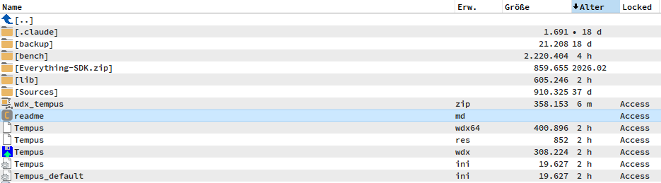

# Tempus — additions in this build

This build of the Tempus content plugin adds four things on top of the original
(age/date, type, group columns): **Everything integration**, an **`ESize`** column,
a **`Locked`** column, and a configurable **age pad character**. Everything is optional and
off-by-default where it could surprise you; all of it is configured in `Tempus.ini`.

---

## 1. Everything (voidtools) integration

Tempus can read [Everything](https://www.voidtools.com/)'s index over IPC to
**(a)** get a folder's newest-descendant date without scanning the filesystem, and
**(b)** show a folder's recursive size. **No extra DLL is shipped or required** —
Tempus talks to a running Everything directly.

### Requirements

- **Everything must be running.** Download: [voidtools.com](https://www.voidtools.com/).
- **Everything 1.4.1 or later.**
- For **folder sizes** (the `ESize` field on folders): enable **"Index folder size"**
  in Everything → **Tools → Options → Indexes**. Tempus checks this over IPC and only
  reads folder sizes when it is actually on.
- Junction/symlink paths (e.g. `C:\Dokumente und Einstellungen\...`) are resolved to
  Everything's real target path automatically.

### Keys (`[Everything]`)

- `UseEverything=1` (default) — the folder-date fields (`Age (Update Dirs)` /
  `Update Dirs Only`) get the newest descendant date from Everything's index instead
  of scanning. Falls back to scanning when Everything is unavailable / the drive isn't
  indexed. Only local fixed drives use the index.
- `UseEverythingSize=0` (default) — the `ESize` field reads **folder** sizes from
  Everything. Off by default; needs "Index folder size" enabled (see above).
- `EverythingTimeoutMs=300` — per-query hard timeout so a stuck query can never
  freeze TC.
- `EverythingCacheTTLSec=30` — how long a folder date/size read from Everything stays
  cached, so repeated queries during a panel render / repaint are instant. Cleared on
  Ctrl+R.

SDK reference: [Everything SDK](https://www.voidtools.com/support/everything/sdk/).

---

## 2. The `ESize` column

Add the column `[=tempus.ESize]`.

- **Files** → native size (always, instantly).
- **Folders** → recursive size from Everything, but only when `UseEverythingSize=1`
  **and** "Index folder size" is enabled; otherwise the folder cell is left empty.
- Offers the usual size units (bytes / KB / MB / GB), like TC's own size column.

---

## 3. The `Locked` column (files only)

Add the column `[=tempus.Locked]`. Shows whether a **file** is currently in use by
another task — modelled on the *LockedTest* plugin:

- `Access` — the file can be opened (not locked).
- `Locked` — another task holds it (open exclusively / for writing).
- `Not found` — the file no longer exists.
- Folders are left empty (files only).

Detection = trying to open the file for reading with no sharing. It runs on a
**background thread** so the UI never blocks; the fast checks (folder / not-found /
cloud placeholder) answer instantly. **Cloud/offline placeholders are skipped** so
browsing never triggers a download.

**Drive gating.** The open is cheap on local disks but a per-file network round-trip
over SMB (and can spin up removable/optical media). So the probe runs on **fixed/RAM
disks always**, but on **network / removable / CD-ROM only when explicitly enabled**;
otherwise the column is simply left blank there — the gate fires *before* the file is
touched. On network drives a short **result cache** (default 5 s) makes repaints reuse
the last Access/Locked instead of re-opening every file; it's cleared on Ctrl+R.

### Keys

`[Options]`
- `UseLockedField=1` (default) — enable the check. `0` leaves the column empty (the
  check opens every listed file, which touches last-access time and can wake AV/sync).

`[Locked Field]`
- `AllowDriveNetwork=0` / `AllowDriveRemovable=0` / `AllowDriveCDRom=0` (defaults) —
  probe files on those drive types too. Fixed/RAM disks are always probed.
- `NetCacheTTLSec=5` — network-only cache lifetime in seconds (`0` = off).
- `Access=Access`, `Locked=Locked`, `NotFound=Not_found` — the value strings, and they
  are **localizable** exactly like the age suffixes (`_` = space; a `<lang>_` variant
  overrides when that `Language` is active). E.g. with `[Options] Language=deu` set
  `deu_Access=Zugriff`, `deu_Locked=Gesperrt`, `deu_NotFound=Nicht_gefunden`.

---

## 4. Padding the age number

The age number can be left-padded so columns line up (`7 days` → ` 7 days`).

### Key (`[Age Field]`)

- `AgeLeadingChar=_` — the pad character: `_` = **space** (default, `7 days` → ` 7 days`),
  `0` = leading zeros (`07 days`), empty = no padding. The width follows the configured
  threshold for each unit: `ThresholdDay=90` → 2 places, `ThresholdDay=180` → 3 places.
  ('_' stands for a space, matching the ini's convention.)

---

Install: close TC, copy `Tempus.wdx` (32-bit TC) and/or `Tempus.wdx64` into the
plugin folder, restart TC, then add the columns via *Configuration → Options →
Custom columns*.
